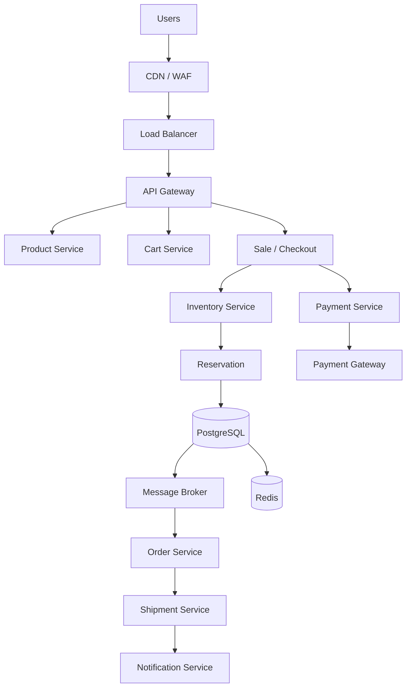
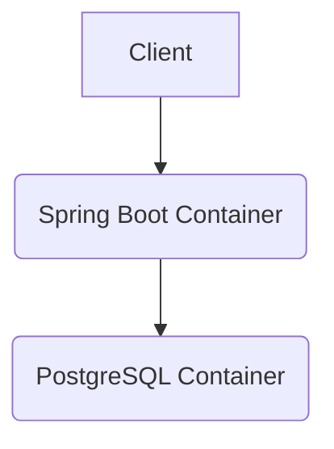

# High-Level Architecture (HLD)

## Canonical Architecture


```

## Runtime Infrastructure (Docker & PostgreSQL)

The system is deployed using containerization to ensure reproducibility and clean separation of concerns.



- **PostgreSQL Container:** The authoritative source of truth for all transactional state (Inventory, Reservations, Orders, Payments). State is persisted safely using external Docker volumes.
- **Spring Boot Application Container:** Runs as a stateless, non-root Java 21 process. It is configured to wait for PostgreSQL health checks before booting.
- **Configuration:** All sensitive credentials and network routes are supplied dynamically via environment variables (`.env`).
- **Testing:** The H2 in-memory database is deliberately retained and utilized by default during local Maven builds (`mvn test`) to ensure unit/integration tests remain lightning-fast and self-contained.

## Service Boundaries & Responsibilities

1. **Inventory Service:** The sole owner of inventory counts. It handles the reservation logic and guarantees no overselling. 
2. **Payment Service:** Abstracts external payment gateways. Handles idempotency of charges and communicates success/failure.
3. **Order Service:** Creates and manages the finalized customer order once payment is confirmed.
4. **API Gateway:** Entry point for traffic, handling rate limiting, authentication, and routing.

## Communication Patterns

- **Synchronous:** Checkout -> Inventory (User needs to know immediately if they got the reservation). Checkout -> Payment (User waits for payment status).
- **Asynchronous (Event-Driven):** Payment -> Order (Once payment succeeds, an event `PaymentSucceeded` is published to the Message Broker. The Order Service consumes this).
- **Background (Scheduled):** Expiry Service runs in the background to sweep `RESERVED` items that have passed their `expiresAt` timestamp and releases them.

## Data Ownership & Consistency

- **PostgreSQL:** The authoritative truth for inventory counts, reservations, and orders.
- **Redis:** Used strictly for read-load reduction (e.g., caching product catalog, available quantity approximations). **Redis is not the authoritative source for inventory.**
- **Inventory Consistency Boundary:** Handled entirely within PostgreSQL via atomic conditional updates (Optimistic Concurrency).
- **Reservation Lifecycle Atomicity:** Releasing reservations relies on an atomic conditional update (`UPDATE Reservation SET status='RELEASED' WHERE status='RESERVED'`). This acts as a concurrency guard so that duplicate releases, expirations, and user-cancels cannot restore inventory multiple times.

## Failure Handling & Order Recovery

- **Payment Failure:** Synchronously releases the reservation in the Inventory Service.
- **Payment Timeout:** Placed into a reconciliation queue to verify with the external gateway before taking final action.
- **Order Service Down (Event Resilience):** We utilize an **At-Least-Once Delivery + Idempotent Consumer** architecture. When a payment succeeds, a `PaymentSucceeded` event is published. If the Order Service is unavailable or crashes during processing, the event is preserved in a retry queue / DLQ (simulated in-memory for the prototype, Kafka in production).
- **Order Processing Idempotency:** The Order table enforces a unique constraint on the `paymentId`. If an event is re-delivered (due to retries or network duplicates), the Order Service intercepts the duplicate insert and safely ignores the redundant event, preventing duplicate orders.
