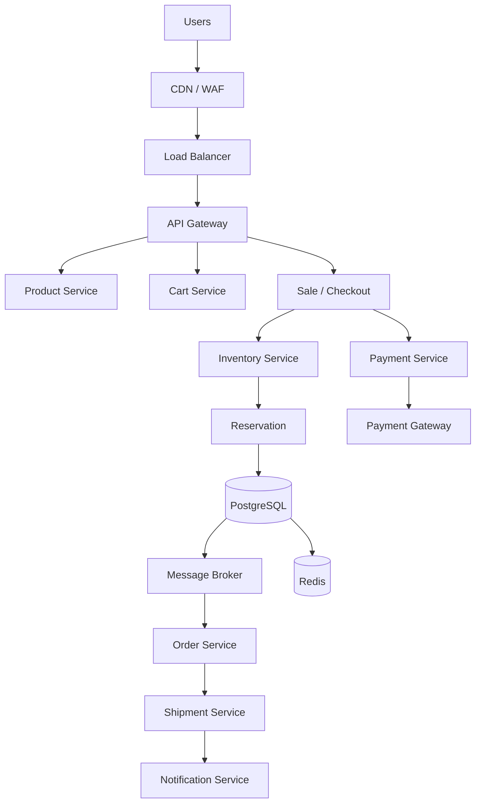

# High-Level Architecture (HLD)

## Canonical Architecture

## Service Boundaries & Responsibilities

1. **Inventory Service:** The sole owner of inventory counts. It handles the reservation logic and guarantees no overselling. 
2. **Payment Service:** Abstracts external payment gateways. Handles idempotency of charges and communicates success/failure.
3. **Order Service:** Creates and manages the finalized customer order once payment is confirmed.
4. **API Gateway:** Entry point for traffic, handling rate limiting, authentication, and routing.

## Communication Patterns

- **Synchronous:** Checkout -> Inventory (User needs to know immediately if they got the reservation). Checkout -> Payment (User waits for payment status).
- **Asynchronous (Event-Driven):** Payment -> Order (Once payment succeeds, an event `PaymentSucceeded` is published to the Message Broker. The Order Service consumes this).

## Data Ownership & Consistency

- **PostgreSQL:** The authoritative truth for inventory counts, reservations, and orders.
- **Redis:** Used strictly for read-load reduction (e.g., caching product catalog, available quantity approximations). **Redis is not the authoritative source for inventory.**
- **Inventory Consistency Boundary:** Handled entirely within PostgreSQL via atomic conditional updates (Optimistic Concurrency).

## Failure Handling & Order Recovery

- **Payment Failure:** Synchronously releases the reservation in the Inventory Service.
- **Payment Timeout:** Placed into a reconciliation queue to verify with the external gateway before taking final action.
- **Order Service Down:** The `PaymentSucceeded` event remains durable in the Message Broker. Once the Order Service recovers, it processes the event and creates the order, ensuring no dropped orders after money is captured.
