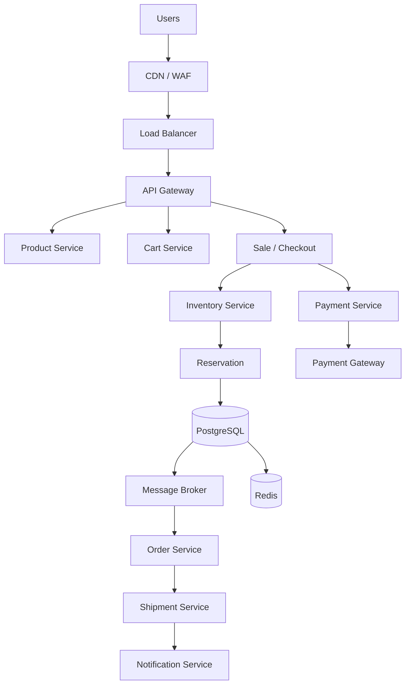
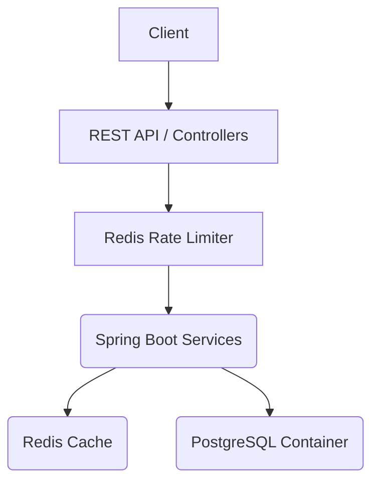

# High-Level Architecture (HLD)

## Canonical Architecture


```

## Runtime Infrastructure (Docker & PostgreSQL, Kafka, Redis)

The system is deployed using containerization to ensure reproducibility and clean separation of concerns.



- **Redis Cache & Rate Limiter:** Protects the application from traffic spikes and offloads reads. It is **NOT** authoritative for inventory. If Redis goes down, the application elegantly degrades by routing reads and checks back to PostgreSQL.
- **PostgreSQL Container:** The authoritative source of truth for all transactional state (Inventory, Reservations, Orders, Payments). State is persisted safely using external Docker volumes.
- **Spring Boot Application Container:** Runs as a stateless, non-root Java 21 process. It is configured to wait for PostgreSQL and Redis health checks before booting.
- **Configuration:** All sensitive credentials and network routes are supplied dynamically via environment variables (`.env`).
- **Testing:** The H2 in-memory database and in-memory caches/events are deliberately retained and utilized by default during local Maven builds (`mvn test`).

## Service Boundaries & Responsibilities

1. **Inventory Service:** The sole owner of inventory counts. It handles the reservation logic and guarantees no overselling. 
2. **Payment Service:** Abstracts external payment gateways. Handles idempotency of charges and communicates success/failure.
3. **Order Service:** Creates and manages the finalized customer order once payment is confirmed.
4. **API Gateway:** Entry point for traffic, handling rate limiting, authentication, and routing.

## Communication Patterns

- **Synchronous:** Checkout -> Inventory (User needs to know immediately if they got the reservation). Checkout -> Payment (User waits for payment status).
- **Asynchronous (Event-Driven via Kafka):** Payment -> Kafka -> Order. Once payment succeeds, a `PaymentSucceeded` event is published to Kafka (`sales.payment.events`). The Order Service consumes this reliably.
- **Background (Scheduled):** Expiry Service runs in the background to sweep `RESERVED` items that have passed their `expiresAt` timestamp and releases them.

## Data Ownership & Consistency

- **PostgreSQL:** The authoritative truth for inventory counts, reservations, and orders.
- **Redis:** Used strictly for read-load reduction (e.g., caching product catalog, available quantity approximations). **Redis is not the authoritative source for inventory.**
- **Inventory Consistency Boundary:** Handled entirely within PostgreSQL via atomic conditional updates (Optimistic Concurrency).
- **Reservation Lifecycle Atomicity:** Releasing reservations relies on an atomic conditional update (`UPDATE Reservation SET status='RELEASED' WHERE status='RESERVED'`). This acts as a concurrency guard so that duplicate releases, expirations, and user-cancels cannot restore inventory multiple times.

## Failure Handling & Order Recovery

- **Payment Failure:** Synchronously releases the reservation in the Inventory Service.
- **Payment Timeout:** Placed into a reconciliation queue to verify with the external gateway before taking final action.
- **Order Service Down (Event Resilience):** We utilize an **At-Least-Once Delivery + Idempotent Consumer** architecture. When a payment succeeds, a `PaymentSucceeded` event is published. If the Order Service is unavailable or crashes during processing, the event is preserved in a retry queue / DLQ (simulated in-memory for the prototype, Kafka in production).
- **Order Processing Idempotency:** The Order table enforces a unique constraint on the `paymentId`. If an event is re-delivered (due to retries or network duplicates), the Order Service intercepts the duplicate insert and safely ignores the redundant event, preventing duplicate orders.

## Payment Provider Abstraction
The system delegates payment processing to isolated provider implementations:
```text
PaymentService
      ↓
PaymentProvider
      ├── MockPaymentProvider
      └── RazorpayPaymentProvider
                    ↓
                 Razorpay
```
- **Mock Provider:** Used seamlessly for local tests and deterministic state verification.
- **Razorpay Provider:** Creates live Razorpay orders.
- **Webhook Reconciliation:** 
```text
Razorpay webhook
      ↓
signature verification
      ↓
idempotent state transition
      ↓
PaymentSucceeded / PaymentFailed
      ↓
Kafka
```

## Observability & Security

Application
    │
    ├── Logs + Correlation ID (MDC)
    ├── Actuator (/actuator/health)
    └── Micrometer Metrics (Prometheus)

All endpoints validate requests and hide stack traces. Webhooks strictly enforce signature validation.
