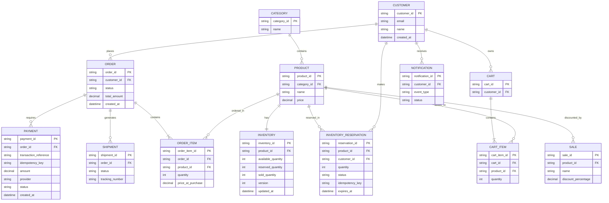

# SALESTORM ER Diagram

This document contains the Entity-Relationship (ER) diagram for the SALESTORM platform, covering all core entities required for the flash sale scenario.

## ER Diagram

```mermaid
erDiagram
    CUSTOMER {
        string customer_id PK
        string email
        string name
        datetime created_at
    }
    
    CATEGORY {
        string category_id PK
        string name
    }
    
    PRODUCT {
        string product_id PK
        string category_id FK
        string name
        decimal price
    }
    
    INVENTORY {
        string inventory_id PK
        string product_id FK
        int available_quantity
        int reserved_quantity
        int sold_quantity
        int version
        datetime updated_at
    }
    
    INVENTORY_RESERVATION {
        string reservation_id PK
        string product_id FK
        string customer_id FK
        int quantity
        string status
        string idempotency_key
        datetime expires_at
    }
    
    CART {
        string cart_id PK
        string customer_id FK
    }
    
    CART_ITEM {
        string cart_item_id PK
        string cart_id FK
        string product_id FK
        int quantity
    }
    
    ORDER {
        string order_id PK
        string customer_id FK
        string status
        decimal total_amount
        datetime created_at
    }
    
    ORDER_ITEM {
        string order_item_id PK
        string order_id FK
        string product_id FK
        int quantity
        decimal price_at_purchase
    }
    
    PAYMENT {
        string payment_id PK
        string order_id FK
        string transaction_reference
        string idempotency_key
        decimal amount
        string provider
        string status
        datetime created_at
    }
    
    SALE {
        string sale_id PK
        string product_id FK
        string name
        decimal discount_percentage
    }
    
    SHIPMENT {
        string shipment_id PK
        string order_id FK
        string status
        string tracking_number
    }
    
    NOTIFICATION {
        string notification_id PK
        string customer_id FK
        string event_type
        string status
    }

    CUSTOMER ||--o{ ORDER : "places"
    CUSTOMER ||--o{ CART : "owns"
    CUSTOMER ||--o{ INVENTORY_RESERVATION : "makes"
    CUSTOMER ||--o{ NOTIFICATION : "receives"
    
    CATEGORY ||--o{ PRODUCT : "contains"
    PRODUCT ||--|| INVENTORY : "has"
    PRODUCT ||--o{ INVENTORY_RESERVATION : "reserved_in"
    PRODUCT ||--o{ CART_ITEM : "added_to"
    PRODUCT ||--o{ ORDER_ITEM : "ordered_in"
    PRODUCT ||--o{ SALE : "discounted_by"
    
    CART ||--|{ CART_ITEM : "contains"
    ORDER ||--|{ ORDER_ITEM : "contains"
    ORDER ||--o{ PAYMENT : "requires"
    ORDER ||--o{ SHIPMENT : "generates"
```
